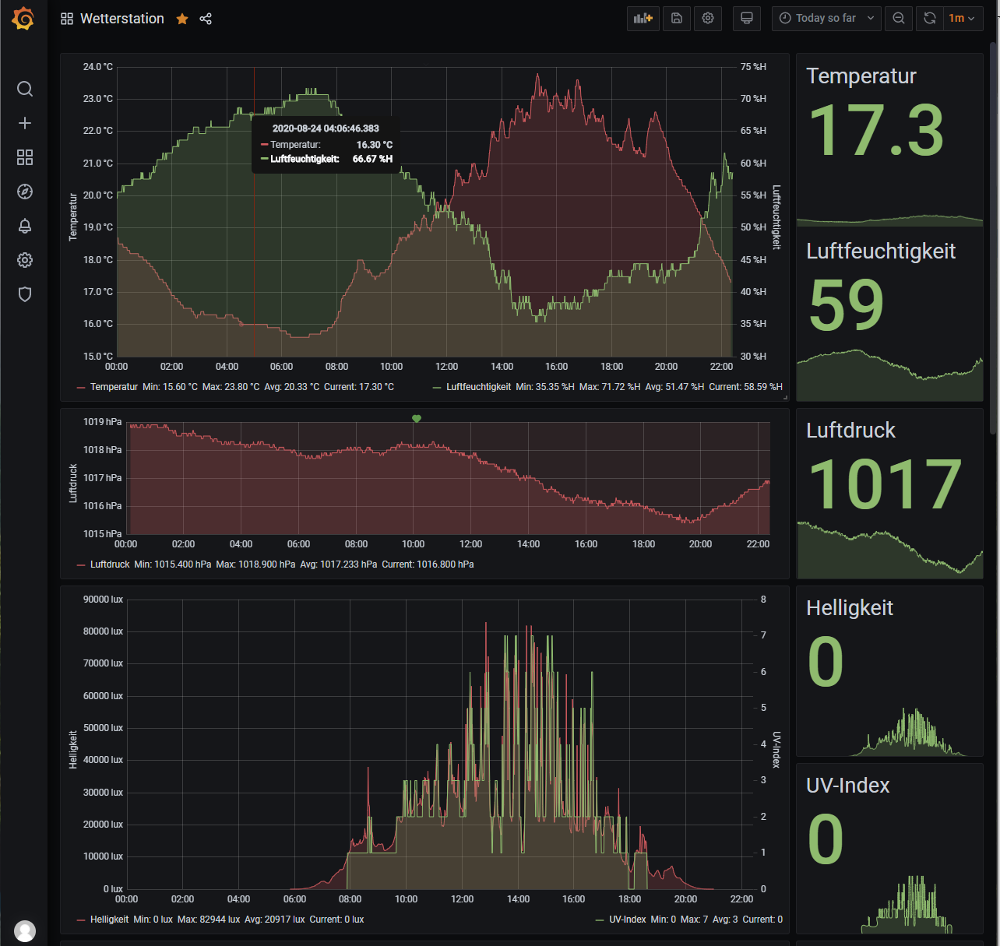
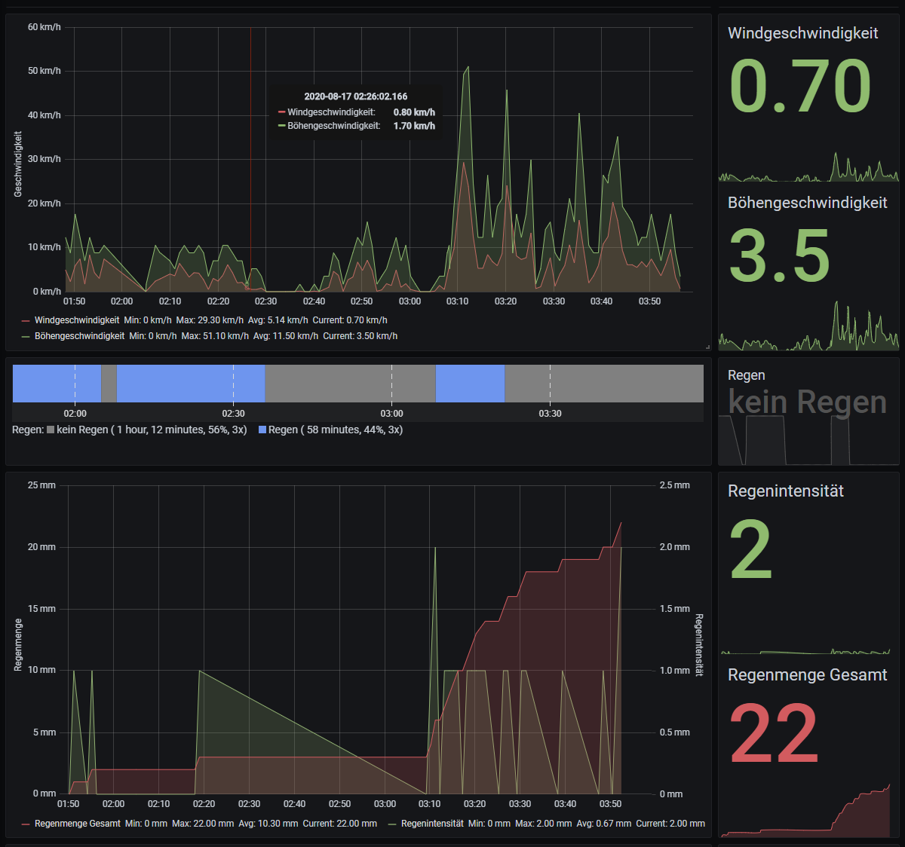
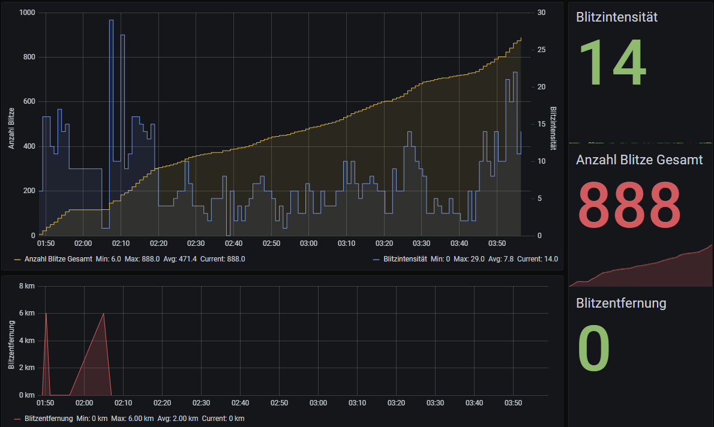
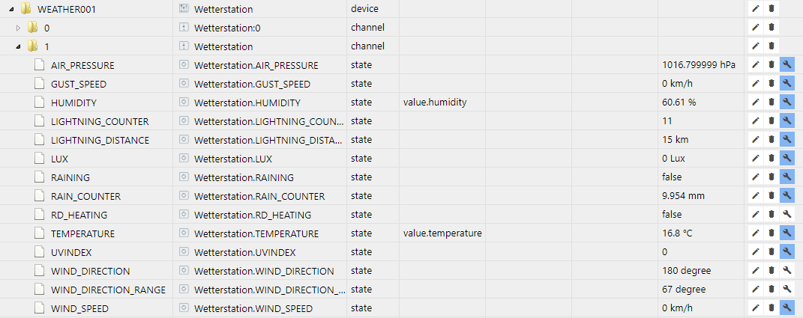
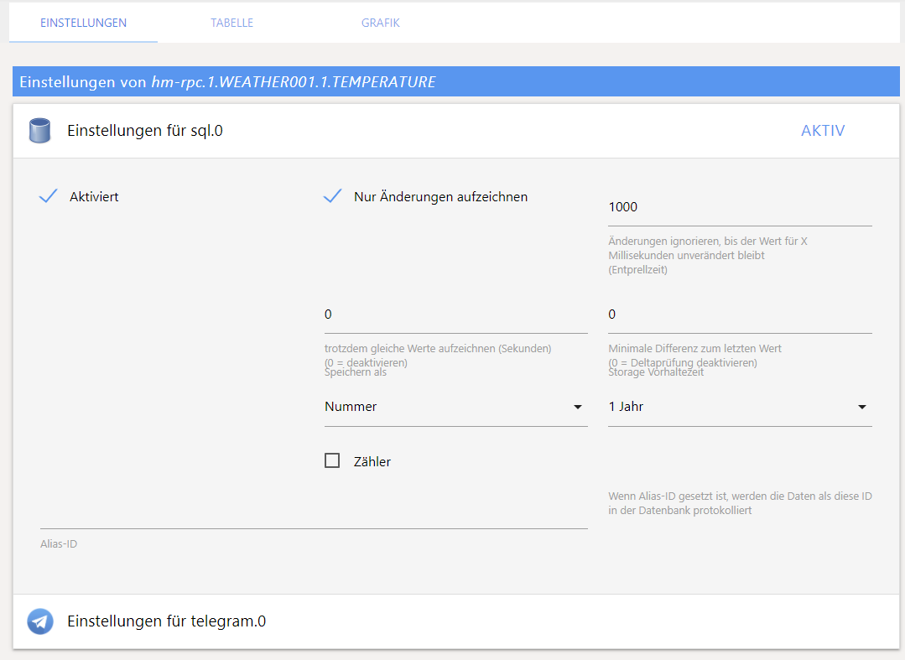
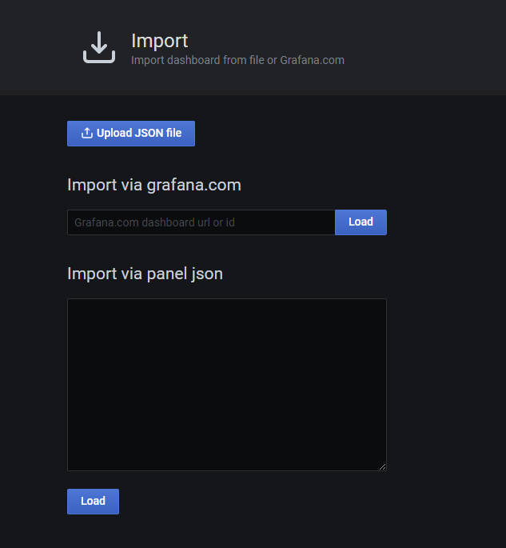

# Grafana-Dashboard zur Visualisierung der Wetterstation HB-UNI-Sen-WEA

## Allgemeines

Dieses Grafana-Dashboard wurde entwickelt, um die Messdaten der Selbstbau-Wetterstation HB-UNI-Sen-WEA für HomeMatic (https://github.com/jp112sdl/HB-UNI-Sen-WEA) grafisch darzustellen und kann auch im Rahmen einer Visualisierung genutzt werden.

Die Daten werden über den Adapter iobroker.hm-rpc (https://www.npmjs.com/package/iobroker.hm-rpc) von der Homematic-Zentrale nach Iobroker übertragen, dort werden sie über den Adapter iobroker.sql (https://www.npmjs.com/package/iobroker.sql) auf einer MySQL- / MariaDB-Datenbank historisiert. Schließlich werden sie aus Grafana von der Datenbank abgefragt und in mehreren Panels dargestellt.

## Features

Folgende Daten werden grafisch dargestellt:

- Temperatur (°C)
- Luftfeuchtigkeit (%rH)
- Luftdruck (hPa)
- Helligkeit (Lux)
- UV-Index
- Windgeschwindigkeit (km/h)
- Böhengeschwindigkeit (km/h)
- Regen / kein Regen
- Regenmenge (mm)
- Regenintensität (mm) 
  - Veränderung der Regenmenge seit letztem Update
- Blitzanzahl
- Blitzintensität
  - Veränderung der Blitzanzahl seit letztem Update
- Blitzentfernung

## Bilder

 
 
 

## Voraussetzungen

Daten werden über den Adapter iobroker.hm-rpc (https://www.npmjs.com/package/iobroker.hm-rpc) von der Homematic-Zentrale nach Iobroker übertragen:

 

Daten werden über den Adapter iobroker.sql (https://www.npmjs.com/package/iobroker.sql) auf einer MySQL- / MariaDB-Datenbank historisiert:

 

## Einbindung in Grafana

- Editieren der Datei [Grafana_Dashboard_Wetterstation.json](dashboard/Grafana_Dashboard_Wetterstation.json) editiert werden
- Suchen nach allen Vorkommen der Zeichenkette WEATHER001 (zum Beispiel 'hm-rpc.1.WEATHER001.1.TEMPERATURE')
- Ersetzen mit der eigenen Seriennummer der Wetterstation (zum Beispiel 'hm-rpc.1.WEATHER001.1.TEMPERATURE' ersetzen durch 'hm-rpc.1.MYSERIAL01.1.TEMPERATURE'
- In Grafana im linken Menü auf + und schließlich Import klicken
- Editierte JSON-Datei auswählen und importieren

 